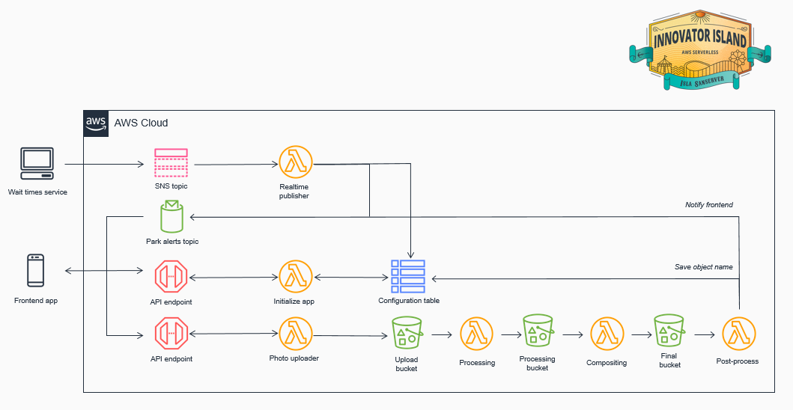
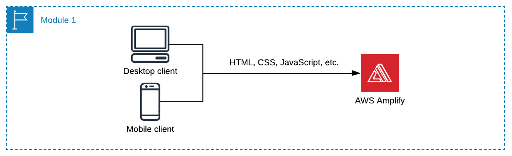
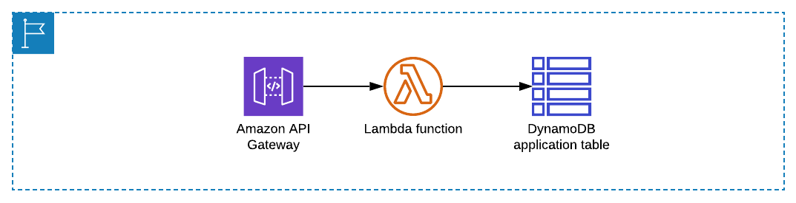

# theme-park-frontend

## Welcome to the Theme Park!
This exciting new theme park, built on the remote island of Isla Sanserver, combines rollercoasters and rides with shows and exhibits. The park is the creation of the billionaire entrepreneur behind Wild Rydes, the unicorn taxi service that sold in 2018. The park will open every day and expects up to 50,000 visitors daily. It’s self-guided, using a web application that guests can browse on their smartphones.

The only “slight” problem is that the development team has suddenly left and the park’s Grand Opening is today! You only have hours to finish assembling the remaining pieces of the application before the gates open. But don’t worry, serverless is at hand! These instructions will guide you through using AWS services to assemble a complete application so you can save the day.

---

## Frontend

The frontend web application consists of an existing JavaScript web application managed with AWS Amplify Console that interfaces with services on the backend. You will only need to make minor changes to a configuration file in the frontend code to complete this workshop.

Amplify Console provides a simple, Git-based workflow for deploying and hosting fullstack serverless web applications. Amplify Console can create both the frontend and backend but for this workshop we will be using Amplify Console for only the frontend.

Amplify will be used to host static web resources including HTML, CSS, JavaScript, and image files which are loaded in the user’s browser via S3.

---

## Architecture

### Overall

### Serverless Frontend

### Serverless Backend
